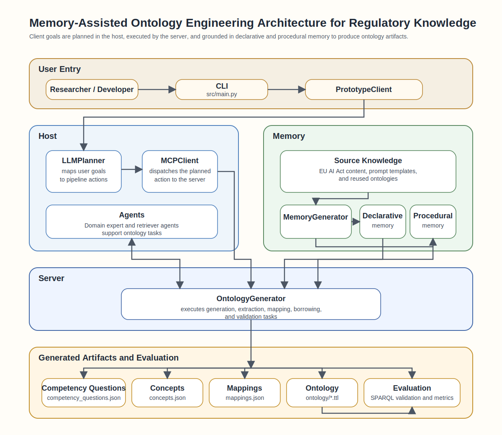
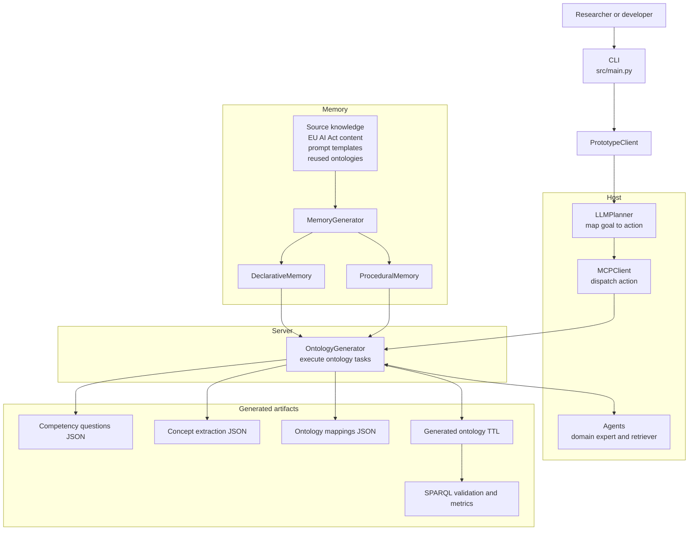

# Project Architecture Figure

This diagram summarizes the main runtime components of the memory-based MCP prototype and the artifacts produced by the pipeline.

Rendered asset: 

```mermaid
flowchart TB
    user[Researcher or developer] --> cli[CLI\nsrc/main.py]
    cli --> client[PrototypeClient]

    subgraph host[Host]
        planner[LLMPlanner\nmap goal to action]
        dispatcher[MCPClient\ndispatch action]
        agents[Agents\ndomain expert and retriever]
    end

    subgraph memory[Memory]
        sources[Source knowledge\nEU AI Act content\nprompt templates\nreused ontologies] --> generator[MemoryGenerator]
        generator --> decl[DeclarativeMemory]
        generator --> proc[ProceduralMemory]
    end

    subgraph server[Server]
        onto[OntologyGenerator\nexecute ontology tasks]
    end

    subgraph outputs[Generated artifacts]
        cqs[Competency questions JSON]
        concepts[Concept extraction JSON]
        mappings[Ontology mappings JSON]
        ontology[Generated ontology TTL]
        validation[SPARQL validation and metrics]
    end

    client --> planner --> dispatcher --> onto
    decl --> onto
    proc --> onto
    onto <--> agents
    onto --> cqs
    onto --> concepts
    onto --> mappings
    onto --> ontology --> validation
```